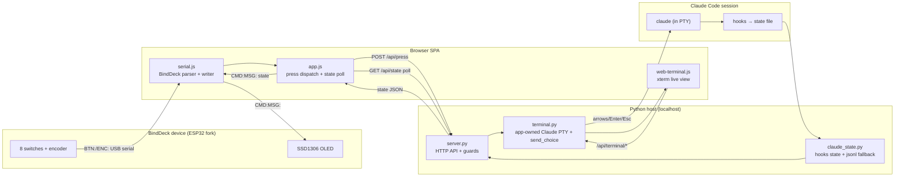
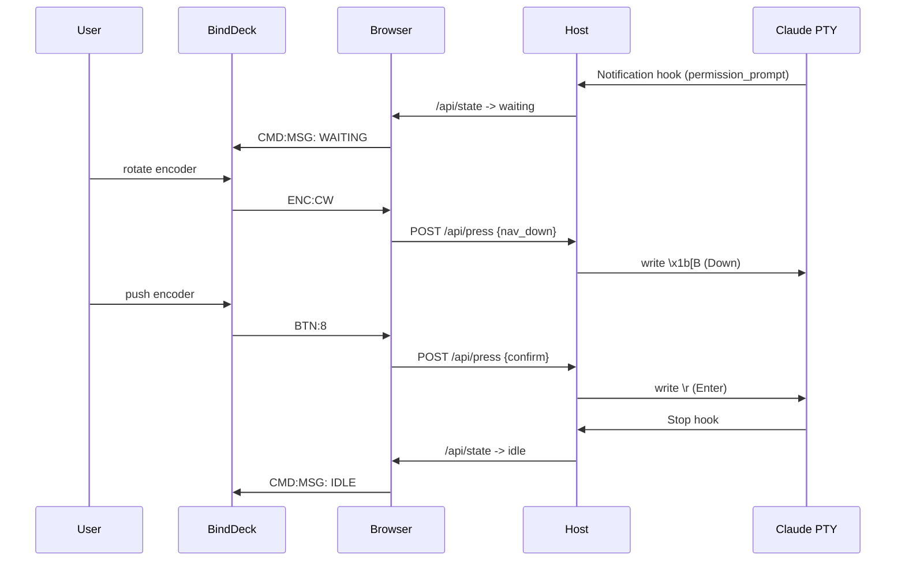

# Application Design — Claude Code retarget on BindDeck

> **Folds** Functional Design + NFR Requirements + NFR Design (per `plans/execution-plan.md`).
> Single unit: **`claude-binddeck-retarget`**. Brownfield migration of the Button Lab bridge from Codex → Claude Code, with the hardware surface swapped from the UNO R4 two-button board to a slimmed **BindDeck** ESP32 fork.
> Ambiguous decisions were auto-confirmed via **GPT arsta mid** (Codex CLI, medium) + AI recommendation per user instruction — see `application-design-consultation.md`.

## 0. Design Decisions Locked (this stage)

| # | Decision | Choice | Source |
|---|---|---|---|
| D1 | PBT dependency strategy | **Install fast-check (npm devDep) + Hypothesis (pip user)**; runtime stays zero-dep; document install | GPT Q1=A |
| D2 | YES/NO fast-path keystrokes | **Table-driven config** (Python dict mirrored in JS), default `YES=Enter`, `NO=Esc`; literal bytes correctable post-smoke-test | GPT Q2=C |
| D3 | Claude state source | **Hooks primary** (state file) + **`.jsonl` transcript fallback** | GPT Q3=A, FR-4 |
| D4 | Answer delivery | **App-owned PTY write** only; no `claude queue` (none exists) | FR-3 |
| D5 | Web Serial locus | Serial I/O lives in the **browser**; OLED feedback is **browser-mediated** (host state → browser poll → `CMD:MSG:` to device) | Web Serial is browser-only API |

## 1. Component Architecture (target)



**Change classes**: `claude_state.py` = new; `output.py` (Codex reader) = removed; `terminal.py` = major; `server.py` = major; `serial.js` = major; `app.js`/`web-terminal.js`/`index.html` = moderate; firmware fork = new; hooks + `.claude/settings.json` = new.

## 2. Removed / Replaced Codex Artifacts (FR-4.3)

| Removed | Replaced by |
|---|---|
| `output.py` `OutputReader` (reads `state_5.sqlite`, `sessions/**.jsonl` `event_msg`) | `claude_state.py` `ClaudeStateReader` (reads hook state file + `~/.claude/projects/**/*.jsonl` fallback) |
| `terminal.py` `detect_thread()` / `SESSION_LOCK` `thread-writer-locks/*.lock` discovery, `target_thread()` | not needed — the app **owns** the Claude PTY, so no external session discovery |
| `server.py` `subprocess.run([codex,"queue","--thread",...,"--message",...])` send path | `terminal.send_choice(action)` PTY write |
| `/api/session` `codexAvailable`; `/api/output` Codex message feed | `/api/session` `claudeAvailable` + `/api/state` Claude state snapshot |
| `web-terminal.js` codex/yolo buttons launching `codex ...` | `claude` launch button |

## 3. Pure Mapping Layer (property-tested — PBT-02/03/07)

### 3.1 Layer 1 — BindDeck line → logical action (frontend, `serial.js`)

Total function over the valid device-line domain. Unmapped/malformed lines yield `null` (ignored), never an action.

| Device line | Logical action |
|---|---|
| `BTN:0` | `yes` |
| `BTN:1` | `no` |
| `BTN:2` | `stop` |
| `BTN:8` | `confirm` (encoder push) |
| `ENC:CW`  (alias `ENC:VDN`) | `nav_down` |
| `ENC:CCW` (alias `ENC:VUP`) | `nav_up` |
| `BTN:3..7`, other `ENC:*`, anything else | `null` (ignored) |

- Framing: newline-delimited (reuse `SerialLineParser`, CRLF-tolerant, oversized-record drop).
- Handshake retained: host writes `BUTTON_LAB_HELLO\n`, device replies `BUTTON_LAB_READY:1\n` (fork implements this; keeps handshake tests meaningful and gives liveness). Actions are dropped until `connected`.

### 3.2 Layer 2 — logical action → PTY key sequence (host, `terminal.py`; **D2 table**)

Single source of truth: `ACTION_KEYS` dict in `terminal.py`, mirrored as `ACTION_KEYS` in `app.js`/tests. Default table:

| Action | Key bytes | Rationale |
|---|---|---|
| `nav_up` | `\x1b[A` (Up) | move menu highlight up |
| `nav_down` | `\x1b[B` (Down) | move menu highlight down |
| `confirm` | `\r` (Enter) | select highlighted option |
| `yes` | `\r` (Enter) | accept default-focused "Yes" (fast path) |
| `no` | `\x1b` (Esc) | decline prompt |
| `stop` | `\x1b` (Esc) | interrupt running turn |

- **D2**: the *literal bytes* are config; property tests assert the mapping is **total** over `{yes,no,stop,confirm,nav_up,nav_down}` and that every action resolves to a **non-empty** sequence — not the exact bytes. A post-hardware smoke test may adjust bytes (e.g., if a build accepts numeric selectors) by editing only the table.
- **State gating**: `stop` is always deliverable. `yes/no/confirm/nav_*` are meaningful only when Claude state == `waiting`; when not waiting they are still written (harmless keystrokes) but the UI/OLED signals "not waiting" so the operator knows the context.

## 4. Component & Method Definitions

### 4.1 `claude_state.py` (new)
```
class ClaudeStateReader:
    def __init__(self, state_file: Path, projects_root: Path = ~/.claude/projects, *, clock=time.monotonic)
    def snapshot(self) -> dict
        # {"status": "waiting"|"active"|"idle"|"offline",
        #  "available": bool, "lastAnswer": str|None,
        #  "source": "hook"|"transcript"|"none", "generation": int}
    def note_answer(self, action: str) -> None   # records last delivered answer for OLED/UI
```
- **Primary**: read `state_file` (JSON written atomically by the hook). If its mtime is within `FRESH_SECONDS` (e.g. 30 s) → trust `status`, `source="hook"`.
- **Fallback**: if the file is missing/stale, tail the newest `~/.claude/projects/**/*.jsonl`; infer `active` (last record an in-flight `assistant`/tool line), `idle` (completed assistant), else `offline`. `source="transcript"`. Schema-tolerant: unknown → `offline`, never raises.
- **Timeouts / robustness (RESILIENCY-10)**: bounded read (last N KB of the jsonl), all file I/O guarded; any error → `offline` (graceful degradation, safe initial state).
- `available` = a Claude PTY is running (queried from `WebTerminal`) OR a fresh hook state exists.

### 4.2 `terminal.py` (major)
- `start(kind, cols, rows)` — extend allow-list to `{"shell","claude"}` (drop `"codex"`). `kind="claude"` launches `claude` in the PTY.
- `ACTION_KEYS: dict[str,bytes]` — D2 table (module constant).
- `send_choice(action: str, generation: int|None=None) -> dict` — resolve `ACTION_KEYS[action]`; reject unknown action (`ValueError`); write bytes to the live Claude PTY with the existing 2 s deadline; return `{"action":..., "status":"sent"}`. Raises if no Claude PTY running (→ 503 upstream). Structured log line per send (RESILIENCY-05).
- `claude_ready() -> bool` — a `kind="claude"` PTY is running and past handshake/startup.
- **Remove** `detect_thread()`, `target_thread()`, `SESSION_LOCK`.

### 4.3 `server.py` (major)
- `SimulatorServer.__init__` — drop `codex` path arg; add `state_file`/`claude` binary; construct `ClaudeStateReader`; keep token/guards.
- `/api/session` (GET) — returns `{claudeAvailable: bool, hasHardware:.., token:.., ...}` (rename from `codexAvailable`).
- `/api/state` (GET, token-guarded) — returns `ClaudeStateReader.snapshot()` for UI polling + OLED driver (replaces `/api/output`).
- `/api/press` (POST, token+Origin+Host guarded, throttled, idempotent by `requestId`) — validate `choice ∈ {yes,no,stop,confirm,nav_up,nav_down}`; call `terminal.send_choice(choice)`; on success record `state.note_answer`; return `{choice, status:"sent"}`. `stop` allowed regardless of state; others require a running Claude PTY (else 503). Reject arbitrary/malformed input (400) exactly as today.
- Remove all `subprocess`/`codex queue` logic and the `target` branch (single PTY now).
- Retain **all localhost guards** (`valid_host`, `X-Simulator-Token` `compare_digest`, Origin check, CSP, `X-Frame-Options`) — NFR-1.

### 4.4 `serial.js` (major)
- `SerialLineParser` — unchanged (newline framing, oversized drop).
- `ButtonSerial` — parse BindDeck lines via `parseDeviceLine(line) -> action|null` (§3.1 table); keep `BUTTON_LAB_HELLO`/`READY` handshake + reconnect/cancel/unplug handling. Add `sendMessage(text)` writing `CMD:MSG:<text>\n` to the writable stream (OLED feedback), best-effort (never throws into the read loop).
- Exports `{SerialLineParser, ButtonSerial, parseDeviceLine}` for tests.

### 4.5 `app.js` / `web-terminal.js` / `index.html` (moderate)
- `press(choice, source)` accepts the 6 actions; virtual board gains STOP + encoder up/down/confirm controls alongside YES/NO.
- `canSend()` gates on `claudeAvailable`.
- Poll `/api/state`; render status (waiting/active/idle) and last answer; forward `state → serial.sendMessage("CLAUDE:<STATUS> <lastAnswer>")` when hardware connected (FR-5).
- `web-terminal.js`: replace codex/yolo launch buttons with a **Start Claude** button (`claude`), keep shell; drop `--dangerously-bypass...` codex yolo.
- Wording throughout: Codex → Claude.

### 4.6 Firmware fork `firmware/binddeck_claude/binddeck_claude.ino` (new — FR-6)
- Retain: 8 switches (`SWITCH_PINS`), KY-040 encoder (CLK=18,DT=19,SW=5), SSD1306 OLED (I2C 0x3C), USB serial 115200.
- Emit: `BTN:<0..8>` on debounced press; `ENC:CW`/`ENC:CCW` per detent; reply `BUTTON_LAB_READY:1` to `BUTTON_LAB_HELLO`.
- Accept: `CMD:MSG:<text>` → render on OLED (state + last answer).
- **Drop**: BLE HID, Wi-Fi UDP, hardware-monitor telemetry (`C:/U:/G:/V:`), battery/idle screens. **No hardcoded credentials** (FR-6.2, NFR-3). Header note: provenance = SanX18/BindDeck, license unresolved (NFR-6).

### 4.7 Claude hooks (new — FR-4.1)
- `hooks/claude_state_hook.py` — reads hook JSON on stdin, maps event → status, writes `state_file` atomically:
  - `UserPromptSubmit` → `active`
  - `Notification` (`notification_type == "permission_prompt"`) → `waiting`
  - `PostToolUse` → `active`
  - `Stop` / `SubagentStop` → `idle`
  - always passes through (exit 0, no decision) — **does not** auto-answer (human-in-the-loop preserved; PermissionRequest auto-answer considered and rejected).
- `.claude/settings.json` (project) — registers the four hooks pointing at the script; `state_file` path shared with the host.

## 5. HTTP API (target contract)

| Endpoint | Method | Guard | Response |
|---|---|---|---|
| `/api/session` | GET | none (static-ish) | `{claudeAvailable, hasHardware?, token, ...}` |
| `/api/state` | GET | token | `ClaudeStateReader.snapshot()` |
| `/api/press` | POST | token+Origin+Host, throttle, idempotent | `{choice, status:"sent"}` / 400/403/429/503 |
| `/api/terminal/{start,write,resize,stop,output}` | POST/GET | token | unchanged (now `kind="claude"`) |

## 6. State Model (in-memory + hook file)

```
status: offline --hook UserPromptSubmit--> active
active  --Notification(permission_prompt)--> waiting
waiting --press(yes/no/confirm) sent to PTY--> active
active  --Stop--> idle
idle    --UserPromptSubmit--> active
any     --transcript stale & no PTY--> offline
```
- `lastAnswer` updated on every successful `/api/press`.
- Safe initial state = `offline` (RESILIENCY: safe default).

## 7. Sequence — S-1 (approve a numbered menu via encoder)



## 8. NFR / Resiliency Design (folded — Q9 subset)

- **RESILIENCY-06 (liveness/health)**: `serial` handshake (`BUTTON_LAB_READY`), `claude_ready()`, `/api/session.claudeAvailable`, `/api/state.available` are the three health signals (device / PTY / Claude). Missing device → `hasHardware:false`; virtual board still works.
- **RESILIENCY-10 (timeouts + graceful degradation)**: PTY write keeps the 2 s deadline; state-file/transcript reads are bounded and non-blocking; on any failure the reader returns `offline` and the SPA stays functional (S-5/S-6).
- **RESILIENCY-05 (observability)**: structured stderr log lines for `press → mapping → send` and every state transition.
- **Idempotency (FR-1.3)**: `/api/press` de-dupes by `requestId` (retained from current design); one physical press = one delivered key sequence.
- **Credential hygiene (NFR-3)**: firmware fork carries no secrets; grep gate in build-and-test.

## 9. Property-Based Test Plan (partial — PBT-02/03/07/08/09; D1)

| ID | Property | Where |
|---|---|---|
| PBT-03 | `parseDeviceLine` is total over generated device lines; valid buttons/encoder map to the fixed action set; everything else → `null` (never a spurious action) | JS fast-check |
| PBT-03 | `ACTION_KEYS` is total over the 6 actions; every action → non-empty bytes; `yes`≠`no` sequences | Py Hypothesis + JS fast-check (mirror) |
| PBT-02 | round-trip: `parseDeviceLine(formatButton(i)) == expected(i)` and `format(parse(line))` stable for the valid domain | JS fast-check |
| PBT-07 | domain generators: `BTN:0..8`, `ENC:{CW,CCW,VUP,VDN}`, plus noise strings — not raw bytes | both |
| PBT-08 | shrinking enabled; seed logged in test output | both |
| PBT-09 | JS = fast-check + `node --test`; Py = Hypothesis + `unittest`; installed as **dev-only** deps | build docs |

Example-based tests (existing style) retained/updated: handshake precedes input, reconnect without dup, unplug → reconnectable error, send path guards, state reader fallback, PTY start allow-list (`claude` not `codex`).

## 10. Compliance Summary (this stage)
- **Security (OFF)**: N/A as blocking; concrete good-practice items kept — no creds in firmware, serial-line whitelist (`parseDeviceLine`), all localhost guards retained.
- **Resiliency (ON, subset)**: RESILIENCY-05/06/10 designed above; 01-04/07-09/11-15 = **N/A** (localhost single process, no infra/persistent data) — rationale in `requirements.md §6`.
- **PBT (ON, partial)**: PBT-02/03/07/08/09 planned §9; PBT-01/04/05/06/10 advisory.
