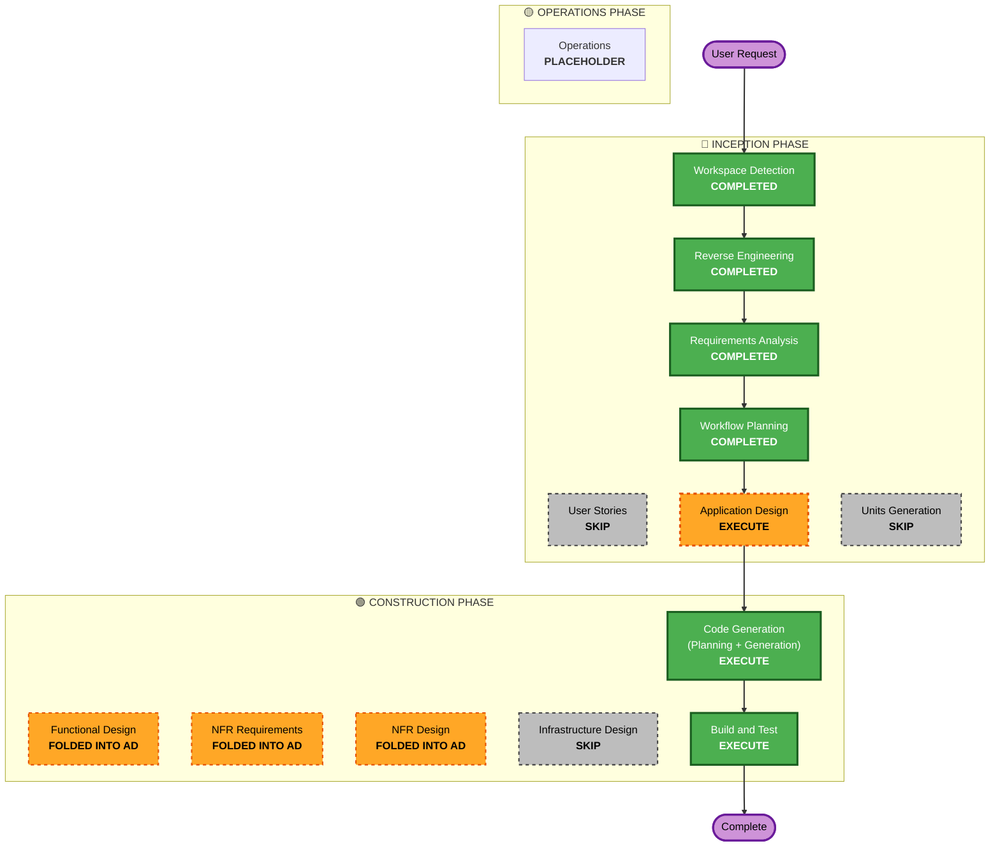

# Execution Plan — Claude Code retarget on BindDeck

## Detailed Analysis Summary

### Transformation Scope (Brownfield)
- **Transformation Type**: Application-layer migration (agent target Codex → Claude Code) + hardware-surface swap (UNO R4 2-button → BindDeck ESP32) + firmware fork. No infrastructure/deployment-model change.
- **Primary Changes**:
  1. Remove Codex coupling in the Python host (`output.py` sqlite/jsonl-event reader, `terminal.detect_thread()` lock discovery, `server.py` `codex queue` subprocess).
  2. Add Claude state reader (hooks-first + `.jsonl` fallback) and finalize the app-owned-PTY send path (`send_choice`).
  3. Adapt `serial.js` / `SerialLineParser` to BindDeck framing (`BTN:`/`ENC:`) and map events → YES/NO/STOP + encoder navigation.
  4. UI: add a "Start Claude" control and Claude-availability gating (replace `codexAvailable` wording).
  5. Fork a slimmed BindDeck firmware sketch (USB-serial + OLED only; no BLE/Wi-Fi/creds).
- **Related Components**: `server.py`, `terminal.py`, `output.py`, `app.js`, `web-terminal.js`, `serial.js`, `index.html`, new `firmware/binddeck_claude/`, tests, Claude hook scripts.

### Change Impact Assessment
- **User-facing changes**: Yes — new hardware interaction (encoder menu nav, OLED feedback), UI Claude controls, virtual board unchanged in spirit.
- **Structural changes**: Moderate — new Claude state-reader module + hook scripts replace Codex reader; serial parser reframed.
- **Data model changes**: No persistent data. In-memory session-state model changes (Codex event model → Claude state model).
- **API changes**: Internal HTTP API mostly stable (`/api/session`, `/api/press`, `/api/terminal/*`); `/api/session` payload gains Claude fields, drops Codex-only fields.
- **NFR impact**: Yes — resiliency subset (timeouts, graceful degradation, liveness, idempotent presses); partial PBT on mapping/parsing.

### Component Relationships
- **Primary Component**: Python host (`server.py` + `terminal.py` + new `claude_state.py`).
- **Shared Components**: frontend JS (`app.js`, `serial.js`, `web-terminal.js`, `index.html`).
- **Supporting Components**: Claude hook scripts (`.claude/` settings + hook handler), firmware fork.
- **Dependent Components**: tests.
- Change types: host reader = **Major**; serial.js = **Major**; UI = **Minor**; firmware = **new**.

### Risk Assessment
- **Risk Level**: **Medium** — isolated to a localhost tool, easy rollback (git worktree/branch), but touches every layer and depends on Claude hook/`.jsonl` behavior that must be verified empirically.
- **Rollback Complexity**: Easy (branch `aidlc-retarget`; original app untouched on its branch).
- **Testing Complexity**: Moderate (pure-function/parse layers unit- + property-tested; PTY/serial/hook I/O exercised via fakes; firmware verified by protocol conformance, not hardware-in-loop in CI).

## Workflow Visualization

## Phases to Execute

### 🔵 INCEPTION PHASE
- [x] Workspace Detection (COMPLETED)
- [x] Reverse Engineering (COMPLETED)
- [x] Requirements Analysis (COMPLETED)
- [x] User Stories (SKIP) — *Rationale:* single-developer localhost tool; user-facing behavior already captured as scenarios S-1..S-6 in requirements.md; no multiple personas.
- [x] Workflow Planning / Execution Plan (COMPLETED)
- [ ] Application Design — **EXECUTE** — *Rationale:* new adapter modules (BindDeck serial mapping, Claude state reader, hook contract) need component/method definition; PBT-01 property identification is done here.
- [ ] Units Generation — **SKIP** — *Rationale:* one cohesive unit (`claude-binddeck-retarget`); not multiple independent services/packages.

### 🟢 CONSTRUCTION PHASE (single unit: `claude-binddeck-retarget`)
- [ ] Functional Design — **FOLDED INTO Application Design** — *Rationale:* mapping tables + state model + testable properties documented in the AD artifact; separate stage adds no value at this scale.
- [ ] NFR Requirements — **FOLDED INTO Application Design** — *Rationale:* framework selection (fast-check, Hypothesis) + resiliency subset captured in AD/requirements; no tech-stack ambiguity.
- [ ] NFR Design — **FOLDED INTO Application Design** — *Rationale:* timeout/graceful-degradation/liveness patterns documented in AD.
- [ ] Infrastructure Design — **SKIP** — *Rationale:* no cloud/deployment infrastructure; runs from source on localhost.
- [ ] Code Generation — **EXECUTE (ALWAYS)** — plan + implement host, frontend, firmware, hooks, tests.
- [ ] Build and Test — **EXECUTE (ALWAYS)** — run Python `unittest` + JS `node --test` (incl. PBT), document manual hardware/Claude smoke test.

### 🟡 OPERATIONS PHASE
- [ ] Operations — PLACEHOLDER.

## Package Change Sequence (single module)
1. Host reader/send (`claude_state.py`, `terminal.py`, `server.py`, `output.py` removal/replacement) — foundation.
2. Frontend (`serial.js`, `app.js`, `web-terminal.js`, `index.html`) — depends on host API shape.
3. Firmware fork (`firmware/binddeck_claude/`) — independent; conforms to the `BTN:`/`ENC:` protocol the host now expects.
4. Claude hook scripts + `.claude/` settings — independent; feed the host state reader.
5. Tests — last, covering mapping/parse (PBT) + reader/send (fakes).

## Estimated Timeline
- **Total stages to execute**: 3 (Application Design, Code Generation, Build & Test) + this plan.
- **Estimated duration**: single working session (auto-proceeding).

## Success Criteria
- **Primary Goal**: A user can approve/deny/navigate a live Claude Code permission prompt using BindDeck (YES/NO/STOP buttons + encoder), with Claude state shown on the OLED, and the virtual board working with no hardware.
- **Key Deliverables**: adapted host (Claude state reader + PTY send, Codex code removed), adapted `serial.js`, UI Claude controls, slimmed firmware fork (no creds/BLE/Wi-Fi), Claude hook scripts, passing unit + property tests, build/test + manual-smoke instructions.
- **Quality Gates**: `python -m unittest` and `node --test` green; PBT (partial mode) green with seed logging; no hardcoded secrets; existing localhost security guards intact.
- **Integration Testing**: button-press → mapping → PTY delivery → state transition → OLED feedback exercised with fakes; documented hardware+Claude manual smoke test.
