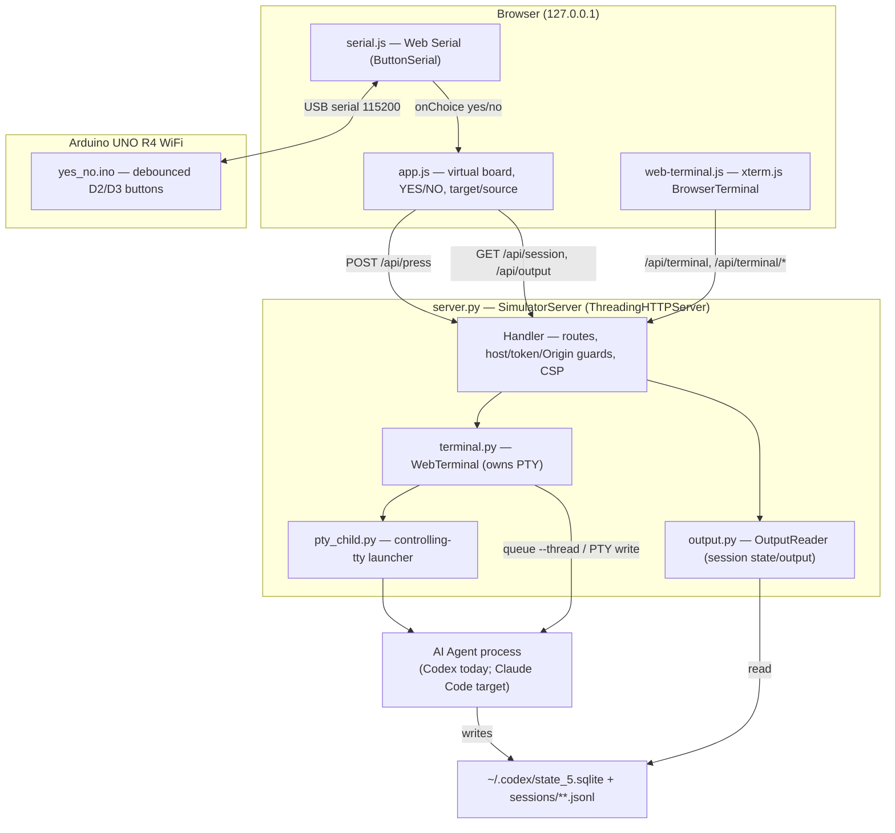
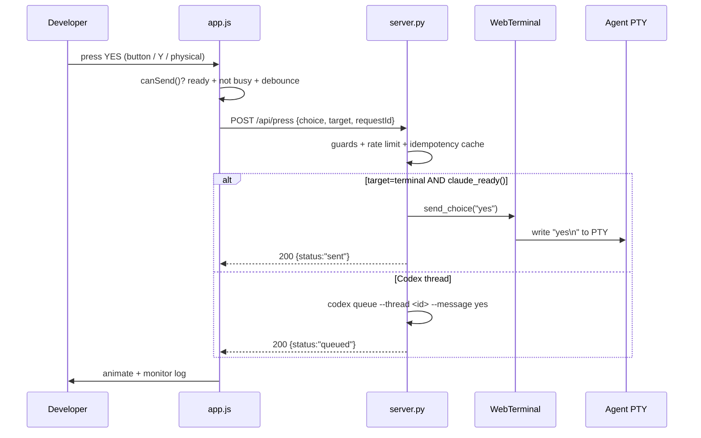

# System Architecture

## System Overview

Button Lab is a **single-process, localhost-only Python HTTP server** that serves a static single-page web UI and a small JSON API. The server owns one PTY-backed "web terminal" and bridges YES/NO answers from the browser (or a physical Arduino) into a running AI coding-agent session. There is no database, no build step, and no external service; the only vendored assets are xterm.js and its fit addon. It targets one user on one machine.

## Architecture Diagram

## Component Descriptions

### `server.py` — `SimulatorServer` + `Handler`
- **Purpose**: HTTP entrypoint; serves the SPA and the JSON API; performs the answer-delivery decision.
- **Responsibilities**: Static asset serving; `GET /api/session|/api/output|/api/terminal`; `POST /api/press` and `/api/terminal/{start,input,resize,stop}`; security guards (localhost Host check, per-server bearer token, Origin check, CSP/nosniff/frame headers); rate-limiting and idempotency (`requestId` reply cache); routing an answer either to Codex (`codex queue`) or to a terminal-hosted Claude session (PTY write).
- **Dependencies**: `terminal.WebTerminal`, `output.OutputReader`, Python stdlib (`http.server`, `subprocess`).
- **Type**: Application (backend).

### `terminal.py` — `WebTerminal`
- **Purpose**: Owns and manages the browser-facing PTY session.
- **Responsibilities**: `start(kind)` for `shell`/`codex`/`claude`; non-blocking read into a bounded 512 KiB ring buffer; `write`/`resize`/`stop`; `detect_thread()` session discovery (process-tree walk → `/proc/<pid>/fd` or `lsof` → `thread-writer-locks/<uuid>.lock`); `send_choice()`/`claude_ready()` for delivering an answer to a terminal-hosted agent over its PTY; holds an `OutputReader` for the discovered thread.
- **Dependencies**: `output.OutputReader`, `pty_child.py`, stdlib (`pty`, `select`, `fcntl`, `termios`, `subprocess`).
- **Type**: Application (backend).

### `output.py` — `OutputReader`
- **Purpose**: Incrementally read one session's visible items and status.
- **Responsibilities**: Locate the session rollout file via `~/.codex/state_5.sqlite` (`threads` table) or `sessions/**/*-<uuid>.jsonl` glob; tail the JSONL; parse `event_msg` records into status (`active`/`idle`) and a bounded deque of visible events (`AgentMessage`/`UserMessage`/`CommandExecution`); expose incremental `snapshot()` with generation/reset semantics.
- **Dependencies**: stdlib only (`sqlite3`, `json`, `re`).
- **Type**: Application (backend). **Codex-format specific.**

### `pty_child.py`
- **Purpose**: Minimal helper that becomes a session/controlling-tty leader then `execv`s the shell/agent so job control and TTY behavior work.
- **Type**: Application (backend, launched per terminal).

### Frontend (`app.js`, `web-terminal.js`, `serial.js`, `index.html`, `style.css`)
- **Purpose**: The SPA control surface (see business-overview.md).
- **Dependencies**: Vendored `xterm.js` + `addon-fit.js`; browser Web Serial API.
- **Type**: Application (frontend).

### `firmware/yes_no/yes_no.ino`
- **Purpose**: Arduino sketch: two debounced buttons (D2=yes, D3=no, `INPUT_PULLUP`), HELLO/READY handshake, emits `yes\n`/`no\n`.
- **Type**: Firmware.

## Data Flow (answer to a terminal-hosted agent)

## Integration Points

- **External APIs**: None (no network egress; localhost only).
- **CLIs invoked**: `codex` (`codex queue ...`), and processes launched in the PTY (`shell`, `codex`, `claude`). `ps`/`lsof` for process discovery.
- **Databases**: `~/.codex/state_5.sqlite` opened **read-only** to resolve a thread's rollout path. No app-owned DB.
- **Filesystem**: `~/.codex/sessions/**/*.jsonl` (read), `thread-writer-locks/*.lock` (existence read via fd links).
- **Third-party services**: None. Browser Web Serial talks to a locally attached USB board.

## Infrastructure Components

- **CDK Stacks / Terraform / CloudFormation**: None.
- **Deployment Model**: `python3 server.py` on the developer's own machine; bound to `127.0.0.1:8765`. No containers, no cloud.
- **Networking**: Loopback only; Host header restricted to `127.0.0.1`/`localhost`; per-process random token required for all API calls; `serial=(self)` permissions policy.
