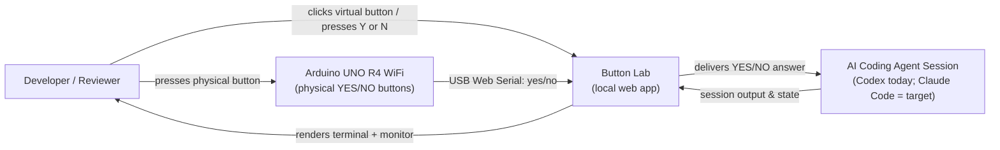

# Business Overview

## Business Context Diagram

## Business Description

- **Business Description**: Button Lab is a local, single-user "hardware answer button" for an AI coding agent. When an interactive agent session pauses to ask the developer a yes/no question (e.g., an approval prompt), the developer can answer with a **physical Arduino button**, an **on-screen virtual button**, or a **keyboard shortcut** — without switching windows back to the terminal. It is a small DIY realization of the idea "a dedicated hardware response surface for AI coding agents." Everything runs on `127.0.0.1`; nothing is deployed or shared.

- **Business Transactions** (the value-bearing interactions the system implements):
  1. **Answer the agent (YES/NO)** — Send a `yes`/`no` answer to the connected agent session from any of three input sources (virtual button, keyboard `Y`/`N`, physical board).
  2. **Run an agent/shell session in the browser** — Start, type into, resize, and stop a PTY-backed terminal (shell, Codex, or Codex-YOLO) rendered with xterm.js.
  3. **Attach to an agent session** — Auto-discover the agent session launched inside the web terminal (via its session-lock file), or bind to a pre-specified existing session id.
  4. **Observe session activity** — Determine and display whether the session is active / idle / waiting, and stream its recent visible output.
  5. **Pair a physical board** — Handshake with an Arduino over Web Serial and receive debounced physical button presses as `yes`/`no`.

- **Business Dictionary**:
  - **Answer / Choice**: A single `yes` or `no` reply the developer gives the agent.
  - **Session / Thread**: One running agent conversation. Codex calls it a *thread* (a UUID); the code uses `thread` throughout.
  - **Target**: Which session an answer goes to — `terminal` (the agent started inside the web terminal) or `current` (a pre-specified existing session).
  - **Input Source**: Where a press originates — `web` (virtual board + keyboard) or `hardware` (physical USB board).
  - **Web Terminal**: The browser-hosted, PTY-backed terminal the server owns and streams.
  - **Readiness**: Whether the chosen session is connected and has persisted enough state that an answer can be delivered; buttons stay disabled until ready.
  - **Handshake**: The Web Serial exchange `BUTTON_LAB_HELLO` → `BUTTON_LAB_READY:1` that confirms the board runs Button Lab firmware.

## Component Level Business Descriptions

### Web UI (`index.html`, `app.js`, `style.css`)
- **Purpose**: Give the developer a friendly control surface — a simulated UNO R4 board, YES/NO buttons, target/source selectors, a serial monitor, and connection hints.
- **Responsibilities**: Capture presses from three sources, enforce "only send when ready," POST answers, reflect connection state, and animate feedback.

### Physical Board Bridge (`serial.js`, `firmware/yes_no/yes_no.ino`)
- **Purpose**: Let a real Arduino UNO R4 WiFi act as the answer buttons.
- **Responsibilities**: Firmware debounces two buttons and emits `yes`/`no`; the browser handshakes over Web Serial and forwards physical presses into the same answer flow.

### Web Terminal (`web-terminal.js`, `terminal.py`, `pty_child.py`)
- **Purpose**: Run and interact with the agent (or a shell) directly in the browser so the developer never leaves the page.
- **Responsibilities**: Own a PTY, stream bounded output, accept keystrokes/resizes, and — for the answer flow — expose the running agent so answers can be delivered to it.

### Answer & Session Bridge (`server.py`, `output.py`)
- **Purpose**: The trusted local backend that connects the UI to the real agent.
- **Responsibilities**: Serve the app and APIs with localhost/token/Origin guards, deliver answers to the agent (Codex `queue`, or a direct PTY write for a terminal-hosted agent), discover the session, and read session state/output.
