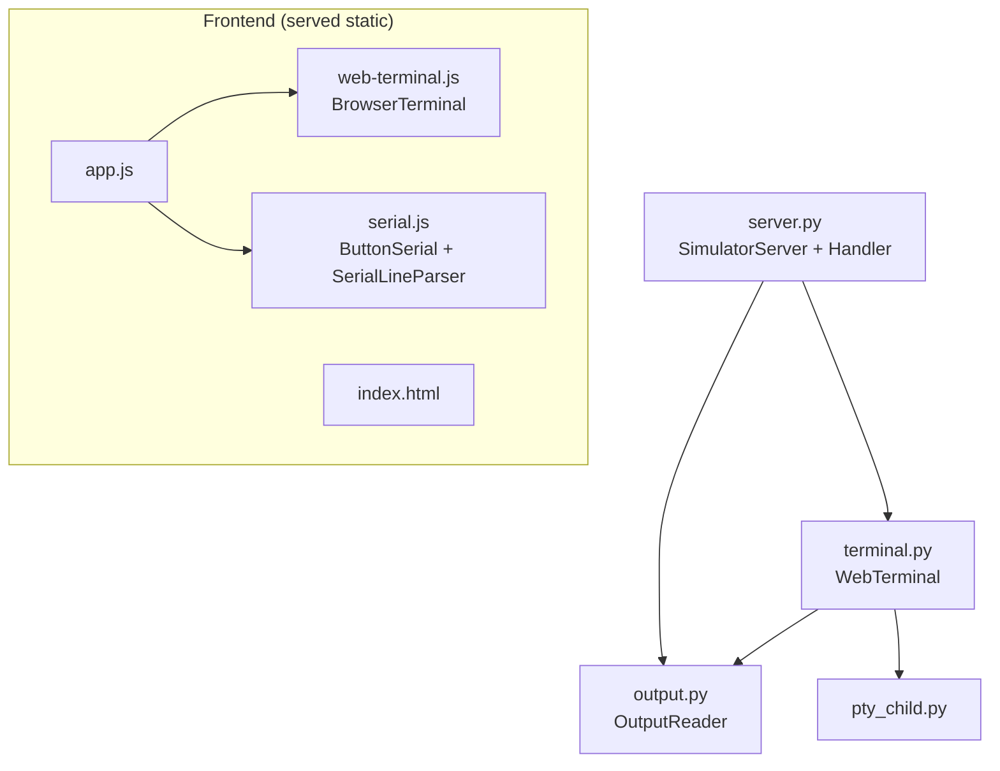

# Code Structure

## Build System
- **Type**: None (no package manager, no bundler, no compiler for the app itself).
  - **Python**: run directly with `python3 server.py` (stdlib only; requires Python ≥ 3.10 — uses `Path.is_relative_to`, structural conveniences).
  - **Frontend**: static files served as-is; libraries vendored under `vendor/` (no npm install / build).
  - **Firmware**: compiled/uploaded via Arduino IDE (UNO R4 Boards package).
- **Configuration**: CLI flags only — `--port` (default 8765), `--thread` (default `$CODEX_THREAD_ID`), `--cwd` (web-terminal working directory).

## Key Modules

### Existing Files Inventory
Candidates for modification during the Codex→Claude retarget are marked **[RETARGET]**; files expected to stay largely as-is are marked **[REUSE]**.

- `server.py` (240 lines) — HTTP server, routing, security guards, answer-delivery decision, `codex queue` call, idempotency cache. **[RETARGET]** (answer routing, availability flags).
- `terminal.py` (241 lines) — `WebTerminal`: PTY ownership, output buffer, `detect_thread()` (Codex lock-file discovery), `send_choice()`/`claude_ready()` (already present), `start()` supports `kind="claude"`. **[RETARGET]** (discovery + state for Claude) / partly **[REUSE]** (PTY, write, resize, stop).
- `output.py` (203 lines) — `OutputReader`: Codex sqlite/JSONL parsing → status + visible events. **[RETARGET]** (Claude has different state/transcript mechanisms).
- `pty_child.py` (10 lines) — controlling-tty launcher. **[REUSE]**.
- `app.js` (288 lines) — main UI controller, `press()`, session load, source/target logic, connection hints. **[RETARGET]** (Codex-specific labels/flags: `codexAvailable`, hint text, target options).
- `web-terminal.js` (176 lines) — `BrowserTerminal`: xterm.js, polling, start `shell`/`codex`/`codex-yolo`, `checkButtonReady`. **[RETARGET]** (needs a Claude launch path + readiness that isn't Codex-only) / **[REUSE]** (PTY streaming, input, resize).
- `serial.js` (99 lines) — `ButtonSerial` + `SerialLineParser`, Web Serial handshake, `yes`/`no` lines. **[REUSE]** (agent-agnostic).
- `index.html` (117 lines) — SVG virtual board, controls, terminal panel, serial monitor, hardware guide. **[RETARGET]** (terminal-action buttons + labels).
- `style.css` (20 lines) — styles. **[REUSE]**.
- `firmware/yes_no/yes_no.ino` (67 lines) — Arduino sketch. **[REUSE]** (transport-agnostic; emits `yes`/`no`).
- `favicon.svg`, `vendor/*` (xterm.js, addon-fit.js, xterm.css + LICENSEs), `vendor/README.md` — assets. **[REUSE]**.
- `tests/test_server.py` (156), `tests/test_output.py` (122), `tests/test_terminal.py` (67), `tests/serial.test.js` (83) — tests. **[RETARGET]** (server/output/terminal tests assert Codex behavior).
- `README.md` (123 lines) — user docs. **[RETARGET]** (Codex-centric).

## Design Patterns

### App-owned PTY (pseudo-terminal broker)
- **Location**: `terminal.py` (`WebTerminal`), `pty_child.py`.
- **Purpose**: Run an interactive CLI agent under a real TTY while the browser drives it; enables both keystroke input and programmatic answer injection (`send_choice`).
- **Implementation**: `pty.openpty()`, child re-parented via `setsid` + `TIOCSCTTY` + `tcsetpgrp`, non-blocking master read loop into a bounded buffer, `TIOCSWINSZ` for resize.

### Incremental tailing with generation/reset tokens
- **Location**: `output.py` (`OutputReader.snapshot`), `terminal.py` (`snapshot`), consumed by `web-terminal.js`/`app.js`.
- **Purpose**: Stream new output to a polling client without resending history; detect file rotation/restart.
- **Implementation**: byte offset + `(st_dev, st_ino)` identity check; random `generation` per session; `reset` flag when the client's cursor/generation is stale.

### Idempotent, rate-limited command dispatch
- **Location**: `server.py` `do_POST` (`replies` cache keyed by `(target/thread, requestId)`, `send_lock`, `last_sent`).
- **Purpose**: Prevent duplicate or racing answer delivery from repeated clicks/retries.

### Defense-in-depth local origin control
- **Location**: `server.py` (`valid_host`, token compare, Origin check, CSP).
- **Purpose**: Keep a locally-bound server that executes real commands from being driven by other origins/tools.

### Handshake-gated serial bridge
- **Location**: `serial.js` (`ButtonSerial`) + firmware; `SerialLineParser` for line framing.
- **Purpose**: Only treat a board as connected after `BUTTON_LAB_READY:1`; ignore unrelated serial chatter.

## Critical Dependencies

### xterm.js (+ `@xterm/addon-fit`)
- **Version**: Vendored snapshot in `vendor/` (see `vendor/README.md` + LICENSE files).
- **Usage**: Renders the web terminal; fit addon sizes it to the panel.
- **Purpose**: Full terminal emulation in the browser with no build step.

### Python standard library
- **Version**: Python ≥ 3.10.
- **Usage**: `http.server` (server), `pty`/`termios`/`fcntl`/`select` (terminal), `sqlite3`/`json`/`re` (output parsing), `subprocess` (agent CLI + discovery).
- **Purpose**: Entire backend with zero third-party packages.

### Browser Web Serial API
- **Usage**: `serial.js` connects to the USB board (desktop Chrome).
- **Purpose**: Physical-button input path.
