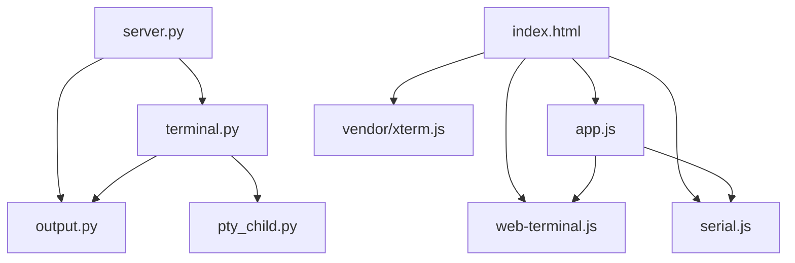

# Dependencies

## Internal Dependencies

### `server.py` depends on `terminal.py`, `output.py`
- **Type**: Runtime (import).
- **Reason**: The server instantiates one `WebTerminal` (PTY + discovery + answer injection) and `OutputReader` (session state) per process.

### `terminal.py` depends on `output.py`, `pty_child.py`
- **Type**: Runtime (import + subprocess).
- **Reason**: `WebTerminal` holds an `OutputReader` for the discovered thread and launches `pty_child.py` as the PTY child that execs the shell/agent.

### `app.js` depends on `web-terminal.js`, `serial.js`
- **Type**: Runtime (browser globals; scripts loaded `defer` in order).
- **Reason**: `app.js` constructs `BrowserTerminal` and `ButtonSerial` and coordinates target/source state.

### Frontend depends on `vendor/xterm.js` + `vendor/addon-fit.js`
- **Type**: Runtime (browser).
- **Reason**: Terminal rendering + auto-fit; loaded before `web-terminal.js`.

## External Dependencies

### Python standard library
- **Version**: bundled with Python ≥ 3.10.
- **Purpose**: `http.server`, `pty`, `termios`, `fcntl`, `select`, `subprocess`, `sqlite3`, `json`, `re`, `secrets`, `pathlib`.
- **License**: PSF.

### xterm.js
- **Version**: vendored snapshot (`vendor/xterm.js`, `vendor/xterm.css`; see `vendor/xterm-LICENSE`).
- **Purpose**: In-browser terminal emulator.
- **License**: MIT.

### @xterm/addon-fit
- **Version**: vendored (`vendor/addon-fit.js`; `vendor/addon-fit-LICENSE`).
- **Purpose**: Fit the terminal to its container.
- **License**: MIT.

## External Runtime Integrations (not code deps, but required at runtime)
- **Codex CLI** — must be installed + logged in for the Codex answer/state paths. Integration pinned around `codex-cli 0.153.4` session/format (per README); Codex updates can break `output.py`/discovery.
- **Claude Code CLI** — detected at startup; used for the terminal-hosted-agent path (target of this project).
- **Web Serial-capable browser** (desktop Chrome) — for the physical-board path.
- **Arduino UNO R4 WiFi + Arduino IDE** — for physical hardware (optional; web simulation needs none).

## Dependency Risk Notes
- **Tight coupling to Codex internals**: `output.py` and `detect_thread()` depend on undocumented, version-specific Codex on-disk formats (`state_5.sqlite` schema, `sessions/**.jsonl` `event_msg` shape, `thread-writer-locks/<uuid>.lock` path). This is the most brittle dependency and the core of the retarget.
- **Platform coupling**: session discovery uses `/proc` (Linux) or `lsof` (macOS); README notes Linux/WSL is "compatible but not yet verified."
