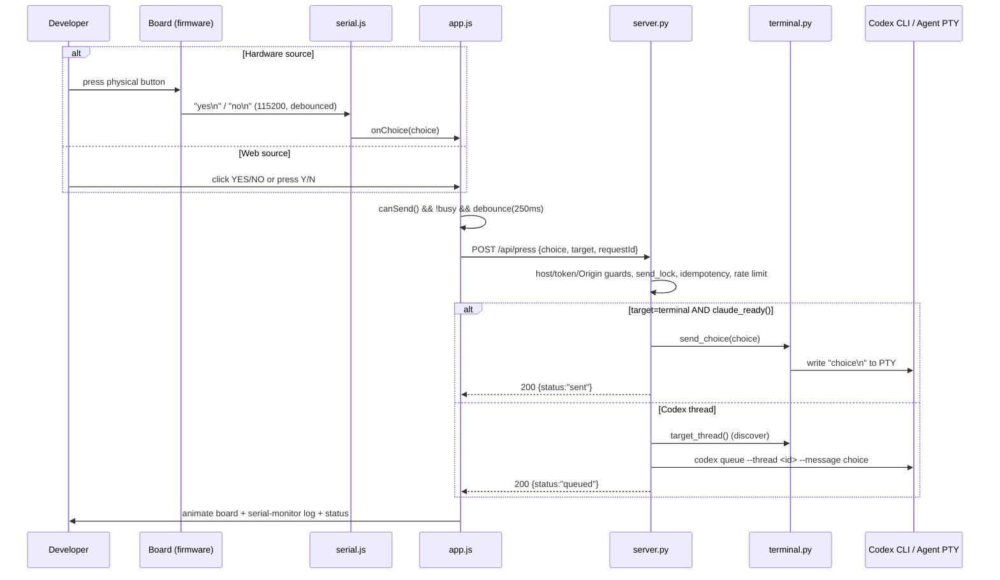
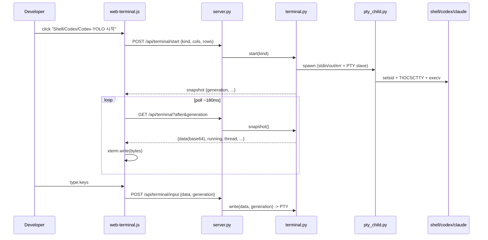
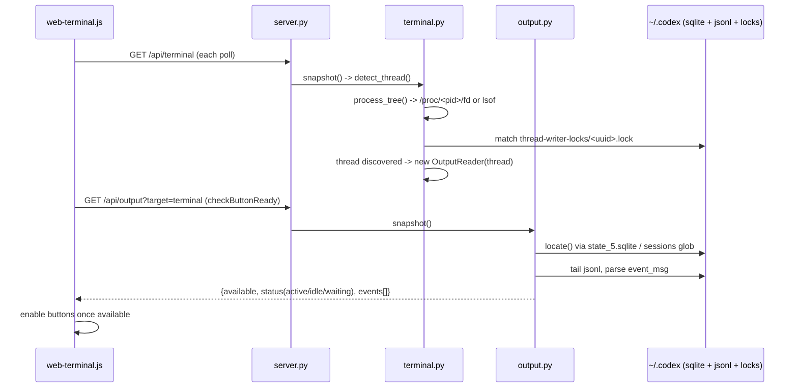

# Interaction Diagrams

How each business transaction is realized across components.

## BT-1: Answer the agent (YES/NO)



## BT-2: Run an agent/shell session in the browser



## BT-3 + BT-4: Attach to session and observe activity



## BT-5: Pair a physical board (Web Serial handshake)

```mermaid
sequenceDiagram
    participant U as Developer
    participant Ser as serial.js
    participant B as Board (yes_no.ino)

    U->>Ser: click "USB 보드 연결"
    Ser->>B: open port 115200; write "BUTTON_LAB_HELLO\n" (every 700ms)
    B->>Ser: "BUTTON_LAB_READY:1\n"
    Ser->>Ser: state = connected (clear handshake timeout)
    loop while connected
        U->>B: press button
        B->>Ser: "yes\n" / "no\n"
        Ser->>Ser: onChoice -> BT-1 (web press with source=hardware)
    end
```
